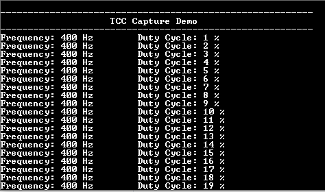

# TCC capture mode

This example shows how to use the TCC module in capture mode to measure duty cycle and frequency of an external input.

## Description

The TC channel is configured in capture mode to measure duty cycle and frequency of the PWM signal. The PWM signal is generated using another TC channel which is configured in compare mode. Output of the compare TC channel is connected to input of the capture TC channel.

## Downloading and building the application

To clone or download this application from Github, go to the [main page of this repository](https://github.com/Microchip-MPLAB-Harmony/csp_apps_pic32ck_gc) and then click **Clone** button to clone this repository or download as zip file.
This content can also be downloaded using content manager by following these [instructions](https://github.com/Microchip-MPLAB-Harmony/contentmanager/wiki).

Path of the application within the repository is **apps/tcc/tcc_capture_mode/firmware** .

To build the application, refer to the following table and open the project using its IDE.

| Project Name      | Description                                    |
| ----------------- | ---------------------------------------------- |
| pic32ck_gc01_cult.X    | MPLABX Project for [PIC32CK GC01 Curiosity Ultra board]()|
|||

## Setting up the hardware

The following table shows the target hardware for the application projects.

| Project Name| Board|
|:---------|:---------:|
| pic32ck_gc01_cult.X    | [PIC32CK GC01 Curiosity Ultra board]()|
|||

### Setting up [PIC32CK GC01 Curiosity Ultra board]()

- Connect the Debug USB port on the board to the computer using a micro USB cable
- Connect Pin 11 (EIC_EXTINT9) and Pin 12 (TCC0_WO0) of EXT1 connector on the board

## Running the Application

1. Open the Terminal application (Ex.:Tera term) on the computer
2. Connect to the PKOB4 Virtual COM port and configure the serial settings as follows:
    - Baud : 115200
    - Data : 8 Bits
    - Parity : None
    - Stop : 1 Bit
    - Flow Control : None
3. Build and Program the application using its IDE
4. Console displays the frequency and duty cycle of the input signal
5. Frequency is constant (400 Hz) and duty cycle changes by 1%

  
