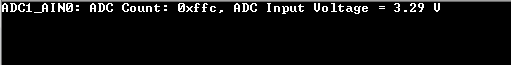

# ADC Blocking

This example application shows how to use the ADC Peripheral library in blocking mode to  convert analog input on a ADC channel.

**Parent topic:**[Harmony 3 Peripheral Library Application Examples for PIC32CK-GC/SG Family](GUID-5EB5829A-8D62-4A5E-B89B-DF7EF4E334A2.md)

## Description

The example application uses Global Software trigger to start a conversion on a ADC  channel input and blocks until the conversion is complete. Once the ADC conversion  is complete, it reads the ADC count value, converts it into analog voltage and  prints it on the serial terminal.

## Downloading and Building the Application

To clone or download this application from Github, go to the [main page of this repository](https://github.com/Microchip-MPLAB-Harmony/csp_apps_pic32ck_sg_gc) and then  click **Clone** button to clone this repository or download as zip file. This  content can also be downloaded using content manager by following these [instructions](https://github.com/Microchip-MPLAB-Harmony/contentmanager/wiki).

Path of the application within the repository is  **apps/adc/adc\_blocking/firmware**.

To build the application, refer to the following table and open the project using its  IDE.

|Project Name|Description|
|------------|-----------|
|pic32ck\_gc01\_cult.X|MPLABX Project for [PIC32CK GC01 Curiosity Ultra board](https://www.microchip.com/en-us/development-tool/ea23j82a)|

## Setting Up the Hardware

The following table shows the target hardware for the application projects.

|Project Name|Board|
|------------|-----|
|pic32ck\_gc01\_cult.X|[PIC32CK GC01 Curiosity Ultra board](https://www.microchip.com/en-us/development-tool/ea23j82a)|

### Setting Up PIC32CK GC01 Curiosity Ultra Board

-   Connect the Debug USB port on the board to the computer using a micro USB cable
-   ADC Core 0 Channel 0 input is available on PA04 \(Pin 3 of EXT1\). Connect PA04 to analog input voltage.

## Running the Application

1.  Build and Program the application using its IDE
2.  Connect to the PKOB4 Virtual COM port and configure the serial settings as follows:
    -   Baud : 115200
    -   Data : 8 Bits
    -   Parity : None
    -   Stop : 1 Bit
    -   Flow Control : None
3.  The demo application will print the ADC count and the corresponding analog  voltage measured on pin PA04 \(Pin 3 of EXT1\):

    

