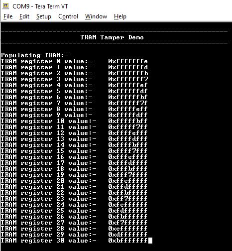
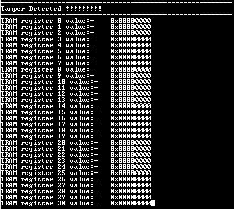

# TRAM Erase On Tamper Detect

This example application shows how to configure and use tamper detect feature of RTC and  TrustRam.

**Parent topic:**[Harmony 3 Peripheral Library Application Examples for PIC32CK-GC/SG Family](GUID-5EB5829A-8D62-4A5E-B89B-DF7EF4E334A2.md)

## Description

This example application shows how to setup and configure tamper detection using the  RTC Peripheral Library. The application populates TrustRam with random data and then  waits for tamper detection to happen. On Tamper detection, application displays the  tamper detected and read the content of the TrustRam. The example demonstrates auto  erase feature of the TrustRam when tamper is detected.

## Downloading and Building the Application

To clone or download this application from Github, go to the [main page of this repository](https://github.com/Microchip-MPLAB-Harmony/csp_apps_pic32ck_sg_gc) and then  click **Clone** button to clone this repository or download as zip file. This  content can also be downloaded using content manager by following these [instructions](https://github.com/Microchip-MPLAB-Harmony/contentmanager/wiki).

Path of the application within the repository is  **apps/tram/tram\_tamper\_erase/firmware**.

To build the application, refer to the following table and open the project using its  IDE.

|Project Name|Description|
|------------|-----------|
|pic32ck\_gc01\_cult.X|MPLABX Project for [PIC32CK GC01 Curiosity Ultra board](https://www.microchip.com/en-us/development-tool/ea23j82a)|

## Setting Up the Hardware

The following table shows the target hardware for the application projects.

|Project Name|Board|
|------------|-----|
|pic32ck\_gc01\_cult.X|[PIC32CK GC01 Curiosity Ultra board](https://www.microchip.com/en-us/development-tool/ea23j82a)|

### Setting Up PIC32CK GC01 Curiosity Ultra Board

-   Short RTC Input pin \(EXT1, PIN 13\) to Vcc
-   Connect the Debug USB port on the board to the computer using a micro USB cable

## Running the Application

1.  Open the Terminal application \(Ex.:Tera term\) on the computer
2.  Connect to the PKOB4 Virtual COM port and configure the serial settings as follows:
    -   Baud : 115200
    -   Data : 8 Bits
    -   Parity : None
    -   Stop : 1 Bit
    -   Flow Control : None
3.  Build and Program the application using its IDE
4.  Console will print the value contained in the TRAM \(Observe that the TRAM contains non zero values\)

    

5.  To emulate tampering, create a falling edge on the RTC input pin
    -   Short RTC Input pin to Vcc and then remove the short, and connect RTC Input pin to GND to create a falling edge

        |Board|RTC Input|LED Name|
        |-----|---------|--------|
        |[PIC32CK GC01 Curiosity Ultra board](https://www.microchip.com/en-us/development-tool/ea23j82a)|RTC Input 6 \(EXT1, PIN  13\)|LED0|

6.  Console will output the current value of TRAM \(Observe that the TRAM values now read zero indicating a erasure of the TRAM content\)

    

