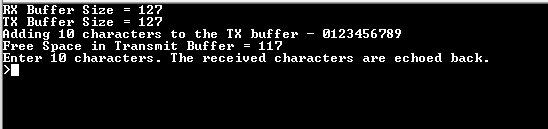
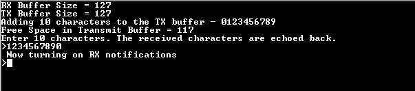
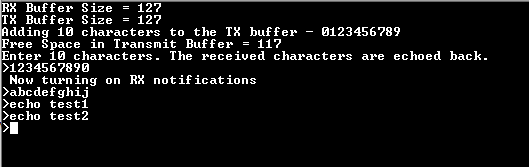

# SERCOM USART Ring Buffer

This example application demonstrates how to use the SERCOM peripheral in USART ring  buffer mode to transfer data in a non-blocking manner.

**Parent topic:**[Harmony 3 Peripheral Library Application Examples for PIC32CK-GC/SG Family](GUID-5EB5829A-8D62-4A5E-B89B-DF7EF4E334A2.md)

## Description

This example demonstrates read and write over USART using the ring buffer mode. The  USART is configured in non-blocking mode \(interrupts enabled\). The example asks the  user to enter 10 characters. Once received, the characters are echoed back. In the  process, the example demonstrates various ring buffer APIs.

## Downloading and Building the Application

To clone or download this application from Github, go to the [main page of this repository](https://github.com/Microchip-MPLAB-Harmony/csp_apps_pic32ck_sg_gc) and then  click **Clone** button to clone this repository or download as zip file. This  content can also be downloaded using content manager by following these [instructions](https://github.com/Microchip-MPLAB-Harmony/contentmanager/wiki).

Path of the application within the repository is  **apps/sercom/usart/usart\_ring\_buffer\_interrupt/firmware**.

To build the application, refer to the following table and open the project using its  IDE.

|Project Name|Description|
|------------|-----------|
|pic32ck\_gc01\_cult.X|MPLABX Project for [PIC32CK GC01 Curiosity Ultra board](https://www.microchip.com/en-us/development-tool/ea23j82a)|

## Setting Up the Hardware

The following table shows the target hardware for the application projects.

|Project Name|Board|
|------------|-----|
|pic32ck\_gc01\_cult.X|[PIC32CK GC01 Curiosity Ultra board](https://www.microchip.com/en-us/development-tool/ea23j82a)|

### Setting Up PIC32CK GC01 Curiosity Ultra Board

-   Connect the Debug USB port on the board to the computer using a micro USB cable

## Running the Application

1.  Open the Terminal application \(Ex.:Tera term\) on the computer
2.  Connect to the PKOB4 Virtual COM port and configure the serial settings as follows:
    -   Baud : 115200
    -   Data : 8 Bits
    -   Parity : None
    -   Stop : 1 Bit
    -   Flow Control : None
3.  Build and Program the application using its IDE
4.  The console displays the following message

    

    -   Console displays the initial transmit and receive buffer sizes
    -   It then adds 10 characters - “0123456789� to the transmit buffer and displays the available free space in the transmit buffer after the 10 characters have been added
    -   The message asks the user to enter 10 characters
    -   *NOTE: For this example, the “Free Space in Transmit Buffer = xx�, where xx can be anything between 117 to 127, depending on the USART baud rate and the CPU execution speed*
5.  Enter 10 characters on the terminal
6.  Entered characters are echoed back on the console and message is displayed indicating that the receive notification is turned on

    

7.  For every 10 characters typed, it will be echoed back on the console and the LED0 is toggled

    

