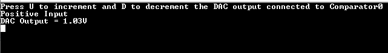
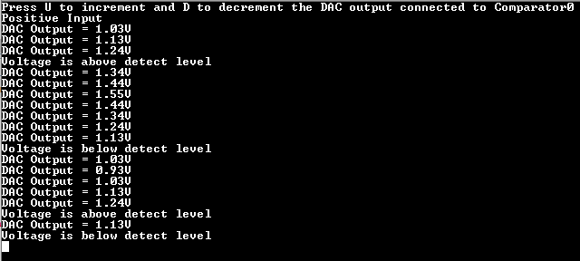

# AC Sleepwalking

This example application shows how to use the AC Peripheral library to perform a single  shot comparison in standby sleep mode periodically and wake up the device when the  comparator output toggles.

**Parent topic:**[Harmony 3 Peripheral Library Application Examples for PIC32CK-GC/SG Family](GUID-5EB5829A-8D62-4A5E-B89B-DF7EF4E334A2.md)

## Description

The negative input of analog comparator is connected to internal Bandgap voltage and  the positive input is connected to internal DAC. The DAC output voltage is varied by  the user. User presses ‘U’/’u’ to increment and ‘D’/’d’ to decrement the DAC output  voltage. Single shot conversion is triggered by RTC compare event. Generation of a  trigger and compare operation are done while the CPU is in the standby sleep mode.  AC generates the interrupt when the comparator output toggles, which wakes the  CPU.

## Downloading and Building the Application

To clone or download this application from Github, go to the [main page of this repository](https://github.com/Microchip-MPLAB-Harmony/csp_apps_pic32ck_sg_gc) and then  click **Clone** button to clone this repository or download as zip file. This  content can also be downloaded using content manager by following these [instructions](https://github.com/Microchip-MPLAB-Harmony/contentmanager/wiki).

Path of the application within the repository is  **apps/ac/ac\_sleepwalk\_singleshot/firmware**.

To build the application, refer to the following table and open the project using its  IDE.

|Project Name|Description|
|------------|-----------|
|pic32ck\_gc01\_cult.X|MPLABX Project for [PIC32CK GC01 Curiosity Ultra board](https://www.microchip.com/en-us/development-tool/ea23j82a)|

## Setting Up the Hardware

The following table shows the target hardware for the application projects.

|Project Name|Board|
|------------|-----|
|pic32ck\_gc01\_cult.X|[PIC32CK GC01 Curiosity Ultra board](https://www.microchip.com/en-us/development-tool/ea23j82a)|

### Setting Up PIC32CK GC01 Curiosity Ultra Board

-   Connect the Debug USB port on the board to the computer using a micro USB cable

## Running the Application

1.  Build and Program the application using its IDE
2.  Connect to the PKOB4 Virtual COM port and configure the serial settings as follows:
    -   Baud : 115200
    -   Data : 8 Bits
    -   Parity : None
    -   Stop : 1 Bit
    -   Flow Control : None
3.  Following message is displayed on the console:

    

4.  Enter ‘U’/’u’ to increment DAC output voltage. Enter ‘D’/’d’ to decrement DAC output voltage.
5.  Following message is displayed on the console when the comparator output toggles:

    

