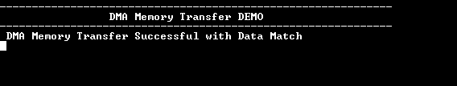

# DMAC Memory Transfer

This example application demonstrates how to use the DMAC peripheral to do a memory to  memory transfer.

**Parent topic:**[Harmony 3 Peripheral Library Application Examples for PIC32CK-GC/SG Family](GUID-5EB5829A-8D62-4A5E-B89B-DF7EF4E334A2.md)

## Description

The application uses a software trigger to initiate a memory-memory transfer from the  source buffer to the destination buffer. After the transfer is complete the  application verifies the data and prints the status on the serial console.

## Downloading and Building the Application

To clone or download this application from Github, go to the [main page of this repository](https://github.com/Microchip-MPLAB-Harmony/csp_apps_pic32ck_sg_gc) and then  click **Clone** button to clone this repository or download as zip file. This  content can also be downloaded using content manager by following these [instructions](https://github.com/Microchip-MPLAB-Harmony/contentmanager/wiki).

Path of the application within the repository is  **apps/dma/dma\_memory\_transfer/firmware**.

To build the application, refer to the following table and open the project using its  IDE.

|Project Name|Description|
|------------|-----------|
|pic32ck\_gc01\_cult.X|MPLABX Project for [PIC32CK GC01 Curiosity Ultra board](https://www.microchip.com/en-us/development-tool/ea23j82a)|

## Setting Up the Hardware

The following table shows the target hardware for the application projects.

|Project Name|Board|
|------------|-----|
|pic32ck\_gc01\_cult.X|[PIC32CK GC01 Curiosity Ultra board](https://www.microchip.com/en-us/development-tool/ea23j82a)|

### Setting Up PIC32CK GC01 Curiosity Ultra Board

-   Connect the Debug USB port on the board to the computer using a micro USB cable

## Running the Application

1.  Build and Program the application using its IDE
2.  Connect to the Virtual COM port and configure the serial settings as follows:
    -   Baud : 115200
    -   Data : 8 Bits
    -   Parity : None
    -   Stop : 1 Bit
    -   Flow Control : None
3.  The transfer status is printed on the serial console:

    

