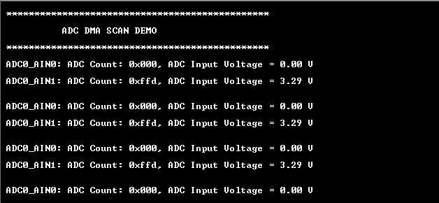

# ADC DMA Scan

This example application shows how to use the ADC Peripheral library in scan mode to  convert multiple analog input on a ADC channels and transfer the ADC result using  DMA.

**Parent topic:**[Harmony 3 Peripheral Library Application Examples for PIC32CK-GC/SG Family](GUID-5EB5829A-8D62-4A5E-B89B-DF7EF4E334A2.md)

## Description

The example configures ADC0 channel 0 and channel 1 in scan mode. The scan trigger  source is configured as ADC trigger event. RTC is configured to generate a periodic  RTC compare match event. ADC trigger is configured as the user of the RTC compare  match event. ADC starts conversion of channel 0 and channel 1 on every scan trigger  and stores the result in the ADC FIFO. DMA is triggered whenever the ADC FIFO has  ADC result. DMA reads the result from ADC FIFO and copies it to the user buffer. DMA  interrupt is generated when results for both the channels are copied to the user  buffer. The application prints the ADC count and the corresponding analog voltage on  the serial terminal.

## Downloading and Building the Application

To clone or download this application from Github, go to the [main page of this repository](https://github.com/Microchip-MPLAB-Harmony/csp_apps_pic32ck_sg_gc) and then  click **Clone** button to clone this repository or download as zip file. This  content can also be downloaded using content manager by following these [instructions](https://github.com/Microchip-MPLAB-Harmony/contentmanager/wiki).

Path of the application within the repository is  **apps/adc/adc\_dma\_scan/firmware**.

To build the application, refer to the following table and open the project using its  IDE.

|Project Name|Description|
|------------|-----------|
|pic32ck\_gc01\_cult.X|MPLABX Project for [PIC32CK GC01 Curiosity Ultra board](https://www.microchip.com/en-us/development-tool/ea23j82a)|

## Setting Up the Hardware

The following table shows the target hardware for the application projects.

|Project Name|Board|
|------------|-----|
|pic32ck\_gc01\_cult.X|[PIC32CK GC01 Curiosity Ultra board](https://www.microchip.com/en-us/development-tool/ea23j82a)|

### Setting Up PIC32CK GC01 Curiosity Ultra Board

-   Connect the Debug USB port on the board to the computer using a micro USB cable
-   ADC Core 0 Channel 0 input is available on PA04 \(Pin 3 of EXT1\). Connect PA04 to analog input voltage.
-   ADC Core 0 Channel 1 input is available on PA05 \(Pin 4 of EXT1\). Connect PA05 to analog input voltage.

## Running the Application

1.  Build and Program the application using its IDE
2.  Connect to the PKOB4 Virtual COM port and configure the serial settings as follows:
    -   Baud : 115200
    -   Data : 8 Bits
    -   Parity : None
    -   Stop : 1 Bit
    -   Flow Control : None
3.  The demo application will print the ADC count and the corresponding analog  voltage measured on pin PA04 \(Pin 3 of EXT1\) and pin PA04 \(Pin 4 of  EXT1\):

    

