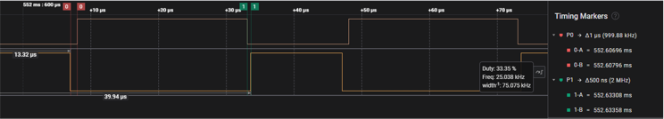

# TCC PWM Generation

This example application shows how to use the TCC to generate a 2 or 3 phase PWM signals  for motor control with dead time.

**Parent topic:**[Harmony 3 Peripheral Library Application Examples for PIC32CK-GC/SG Family](GUID-5EB5829A-8D62-4A5E-B89B-DF7EF4E334A2.md)

## Description

TCC module is configured to generate synchronous 2 or 3 phase PWM signals with dead  time. The duty cycle of the PWM signals is updated in the period interrupt  handler.

## Downloading and Building the Application

To clone or download this application from Github, go to the [main page of this repository](https://github.com/Microchip-MPLAB-Harmony/csp_apps_pic32ck_sg_gc) and then  click **Clone** button to clone this repository or download as zip file. This  content can also be downloaded using content manager by following these [instructions](https://github.com/Microchip-MPLAB-Harmony/contentmanager/wiki).

Path of the application within the repository is  **apps/tcc/tcc\_synchronous\_pwm\_channels/firmware**.

To build the application, refer to the following table and open the project using its  IDE.

|Project Name|Description|
|------------|-----------|
|pic32ck\_gc01\_cult.X|MPLABX Project for [PIC32CK GC01 Curiosity Ultra board](https://www.microchip.com/en-us/development-tool/ea23j82a)|

## Setting Up the Hardware

The following table shows the target hardware for the application projects.

|Project Name|Board|
|------------|-----|
|pic32ck\_gc01\_cult.X|[PIC32CK GC01 Curiosity Ultra board](https://www.microchip.com/en-us/development-tool/ea23j82a)|

### Setting Up PIC32CK GC01 Curiosity Ultra Board

-   Connect the Debug USB port on the board to the computer using a micro USB cable

## Running the Application

1.  Build and Program the application using its IDE
2.  Observe the high-side and low-side PWM waveforms on oscilloscope
3.  Observe the dead time between the high side \(**1us**\) and the low side \(**0.5us**\)
4.  Observe the pwm frequency to be **25 KHz**

PIC32CK GC01 Curiosity Ultra board pin details:

|Signal Name|Pad|Pin|
|-----------|---|---|
|TCC1\_WO0-PWMH|PC15|Pin 16 of EXT2 connector|
|TCC1\_WO4-PWML|PC19|Pin 9 of EXT1 connector|

PIC32CK GC01 Curiosity Ultra board waveforms:

