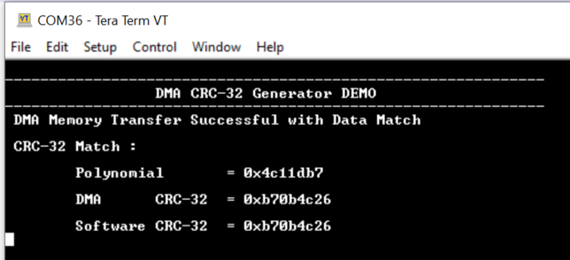

# DMA CRC-32 Generation

This example application demonstrates how to use the DMA peripheral to compute 32-bit  Cyclic Redundancy Checksum \(CRC\).

**Parent topic:**[Harmony 3 Peripheral Library Application Examples for PIC32CK-GC/SG Family](GUID-5EB5829A-8D62-4A5E-B89B-DF7EF4E334A2.md)

## Description

The DMA unit provides support for calculating a CRC-32 value for data passing through  any DMA channel.

This example application computes the 32-bit CRC value for the polynomial  **\(0x4C11DB7\)** using below data source for the CRC engine in DMA  peripheral

-   It uses a DMA Channel with software trigger to initiate a memory-memory transfer from the source buffer to the destination buffer. Once the transfer is completed a 32-bit CRC will be generated for the source buffer.

Once the hardware CRC are generated using above method, it is validated using a  software-calculated CRC value.

## Downloading and Building the Application

To clone or download this application from Github, go to the [main page of this repository](https://github.com/Microchip-MPLAB-Harmony/csp_apps_pic32ck_sg_gc) and then  click **Clone** button to clone this repository or download as zip file. This  content can also be downloaded using content manager by following these [instructions](https://github.com/Microchip-MPLAB-Harmony/contentmanager/wiki).

Path of the application within the repository is  **apps/dma/dma\_crc32\_generate/firmware**.

To build the application, refer to the following table and open the project using its  IDE.

|Project Name|Description|
|------------|-----------|
|pic32ck\_gc01\_cult.X|MPLABX Project for [PIC32CK GC01 Curiosity Ultra board](https://www.microchip.com/en-us/development-tool/ea23j82a)|

## Setting Up the Hardware

The following table shows the target hardware for the application projects.

|Project Name|Board|
|------------|-----|
|pic32ck\_gc01\_cult.X|[PIC32CK GC01 Curiosity Ultra board](https://www.microchip.com/en-us/development-tool/ea23j82a)|

### Setting Up PIC32CK GC01 Curiosity Ultra Board

-   Connect the Debug USB port on the board to the computer using a micro USB cable

## Running the Application

1.  Open the Terminal application \(Ex.:Tera term\) on the computer
2.  Connect to the PKOB4 Virtual COM port and configure the serial settings as follows:
    -   Baud : 115200
    -   Data : 8 Bits
    -   Parity : None
    -   Stop : 1 Bit
    -   Flow Control : None
3.  Build and Program the application using its IDE
4.  LED indicates the success or failure:
    -   LED is turned ON when the DMA memory transfer is successful and hardware CRC values matched with the software calculated CRC value
    -   Following table provides the LED name

        |Board|LED Name|
        |-----|--------|
        |[PIC32CK GC01 Curiosity Ultra board](https://www.microchip.com/en-us/development-tool/ea23j82a)|LED0|

5.  Observe output message in console as follows:
    -   Expected CRC Value for the polynomial **\(0x4C11DB7\)** is **\(0xb70b4c26\)**

        

