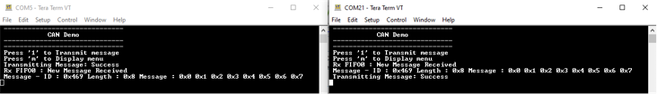

# CAN Blocking

This example application shows how to use the CAN module to transmit and receive normal  CAN messages in polling mode.

**Parent topic:**[Harmony 3 Peripheral Library Application Examples for PIC32CK-GC/SG Family](GUID-5EB5829A-8D62-4A5E-B89B-DF7EF4E334A2.md)

## Description

This application transmits CAN message to CAN Bus and receives CAN message from CAN  Bus. To run this application, two evaluation boards of same type are required. These  boards acts as different nodes on the CAN bus. Same application is programmed onto  both the boards. Boards are connected to PC via UART. While running the application,  user can send and receive CAN messages between the boards using UART console  applications running on the PC.

## Downloading and Building the Application

To clone or download this application from Github, go to the [main page of this repository](https://github.com/Microchip-MPLAB-Harmony/csp_apps_pic32ck_sg_gc) and then  click **Clone** button to clone this repository or download as zip file. This  content can also be downloaded using content manager by following these [instructions](https://github.com/Microchip-MPLAB-Harmony/contentmanager/wiki).

Path of the application within the repository is  **apps/can/can\_normal\_operation\_blocking/firmware**.

To build the application, refer to the following table and open the project using its  IDE.

|Project Name|Description|
|------------|-----------|
|pic32ck\_gc01\_cult.X|MPLABX Project for [PIC32CK GC01 Curiosity Ultra board](https://www.microchip.com/en-us/development-tool/ea23j82a)|

## Setting Up the Hardware

The following table shows the target hardware for the application projects.

|Project Name|Board|
|------------|-----|
|pic32ck\_gc01\_cult.X|[PIC32CK GC01 Curiosity Ultra board](https://www.microchip.com/en-us/development-tool/ea23j82a)|

### Setting Up PIC32CK GC01 Curiosity Ultra Board

-   Connect PIC32CK-GC01 Curiosity Ultra board to another PIC32CK-GC01 Curiosity Ultra board as per the pin connections shown below

|PIC32CK-GC01 Curiosity Ultra  board - 1|PIC32CK-GC01 Curiosity Ultra  board - 2|
|----------------------------------------------------------|----------------------------------------------------------|
|CANH, CAN0|CANH, CAN0|
|CANL, CAN0|CANL, CAN0|
|GND, CAN0|GND, CAN0|

-   Connect the Debug USB port on the board to the computer using a micro USB cable

## Running the Application

1.  Open the Terminal application \(Ex.: Tera term\) on the computer
2.  Connect to the PKOB4 Virtual COM port and configure the serial settings as follows:
    -   Baud : 115200
    -   Data : 8 Bits
    -   Parity : None
    -   Stop : 1 Bit
    -   Flow Control : None
3.  Build and Program the application using its IDE
4.  In the console associated with board 1, press “1� to transmit a CAN message
5.  Transmitted message status will be displayed in the console window of board 1
6.  Received message will be displayed in the console window of board 2
7.  Follow the sequence below to send and receive CAN message:
    -   Press ‘1’ on board 2
8.  If the steps are executed in this sequence, the final output in the consoles will be as below \(console on the left is the transmitter \(board 1\) and the one on the right is receiver \(board 2\)\):

    

