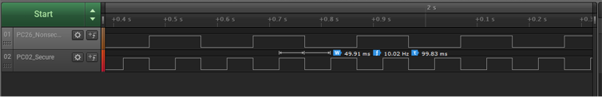

# TrustZone Systick Periodic Timeout

This example application shows how to use the SysTick to generate periodic interrupts on  both Secure and Non-secure modes.

**Parent topic:**[Harmony 3 Peripheral Library Application Examples for PIC32CK-GC/SG Family](GUID-5EB5829A-8D62-4A5E-B89B-DF7EF4E334A2.md)

## Description

This demonstrates TrustZone feature and uses two projects viz., Secure and Non-Secure  Project that work together on the same MCU and offering security isolation between  the Trusted and the Non-trusted resources in the device.

-   Secure project uses secure SysTick timer to generate periodic interrupt every 50ms to toggle a GPIO pin and an LED0
-   Non-secure project uses non-secure SysTick timer to generate periodic interrupt every 100ms to toggle a GPIO pin and an LED1

## Components Used

-   **Systick** - Secure and non-secure systicks
-   **LED0** - Configured as secure mode
-   **LED1** - Configured as non-secure mode
-   **SECURE\_PIN and NON\_SECURE\_PIN** - Configured as secure and non-secure mode respectively

## Downloading and Building the Application

To clone or download this application from Github, go to the [main page of this repository](https://github.com/Microchip-MPLAB-Harmony/csp_apps_pic32ck_sg_gc) and then  click **Clone** button to clone this repository or download as zip file. This  content can also be downloaded using content manager by following these [instructions](https://github.com/Microchip-MPLAB-Harmony/contentmanager/wiki).

Path of the application within the repository is as shown below:

|Type|Path|
|----|----|
|Project group|apps/trustzone/systick/systick\_period\_timeout/pic32ck\_sg01\_cultgroup|
|Secure Project|apps/trustzone/systick/systick\_period\_timeout\_secure|
|Non-Secure Project|apps/trustzone/systick/systick\_period\_timeout|

To build the application, refer to the following table and open the project using its  IDE.

|Project Name|Description|
|------------|-----------|
|  pic32ck\_sg01\_cult\_secure.X  pic32ck\_sg01\_cult.X |Secure and Non-secure MPLABX project  for [PIC32CK SG01 Curiosity Ultra Evaluation Kit](https://www.microchip.com/en-us/development-tool/EA14V17A)|

## Setting Up the Hardware

The following table shows the target hardware for the application projects.

|Project Name|Board|
|------------|-----|
|  pic32ck\_sg01\_cult\_secure.X  pic32ck\_sg01\_cult.X |[PIC32CK SG01 Curiosity Ultra Evaluation Kit](https://www.microchip.com/en-us/development-tool/EA14V17A)|

### Setting Up PIC32CK SG01 Curiosity Ultra Evaluation Kit

-   Connect the Debug USB port on the board to the computer using a micro USB cable
-   Connect an oscilloscope/Logic analyzer to monitor the PORT pin PC02 \(Pin \#8 on EXT1\)
-   Connect an oscilloscope/Logic analyzer to monitor the PORT pin PC26 \(Pin \#6 on EXT1\)

## Running the Application

1.  Open the project group in the MPLAB X IDE and set the non-secure project as main project
2.  Build and program the application
3.  Observe the output for [PIC32CK SG01 Curiosity Ultra Evaluation Kit](https://www.microchip.com/en-us/development-tool/EA14V17A) as follows:

    -   LED0\(Green\) and PC02 \(Secure pin\) is toggled every ~50ms in secure project.
    -   LED1\(Red\) and PC26 \(Non-secure pin\) is toggled every ~100ms in non-secure project
    

