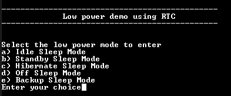
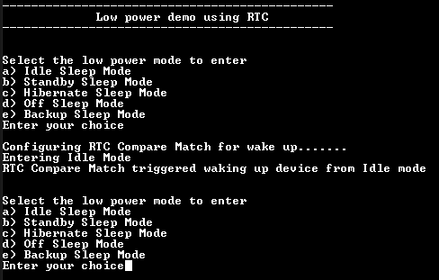
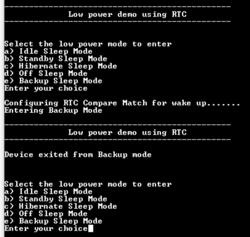

# PM Wakeup Using RTC

This example demonstrates entering the low power modes and exiting it using the RTC.

**Parent topic:**[Harmony 3 Peripheral Library Application Examples for PIC32CK-GC/SG Family](GUID-5EB5829A-8D62-4A5E-B89B-DF7EF4E334A2.md)

## Description

The PM Peripheral library is used to enter into the low power modes, and uses the RTC  timer to wake up the device from the low power mode. The RTC peripheral is run  continuously, including in the device’s low-power sleep modes. The RTC counter value  is continuously compared with the Compare registers and generates compare match  interrupt when compare match occurs to wake up the device.

## Downloading and Building the Application

To clone or download this application from Github, go to the [main page of this repository](https://github.com/Microchip-MPLAB-Harmony/csp_apps_pic32ck_sg_gc) and then  click **Clone** button to clone this repository or download as zip file. This  content can also be downloaded using content manager by following these [instructions](https://github.com/Microchip-MPLAB-Harmony/contentmanager/wiki).

Path of the application within the repository is  **apps/pm/pm\_wakeup\_rtc/firmware**.

To build the application, refer to the following table and open the project using its  IDE.

|Project Name|Description|
|------------|-----------|
|pic32ck\_gc01\_cult.X|MPLABX Project for [PIC32CK GC01 Curiosity Ultra board](https://www.microchip.com/en-us/development-tool/ea23j82a)|

## Setting Up the Hardware

The following table shows the target hardware for the application projects.

|Project Name|Board|
|------------|-----|
|pic32ck\_gc01\_cult.X|[PIC32CK GC01 Curiosity Ultra board](https://www.microchip.com/en-us/development-tool/ea23j82a)|

### Setting Up PIC32CK GC01 Curiosity Ultra Board

-   Connect the Debug USB port on the board to the computer using a micro USB cable
-   Connect VCC and GND between EXT2 and Mikrobus Xplained board

## Running the Application

1.  Open the Terminal application \(Ex.:Tera term\) on the computer
2.  Connect to the PKOB4 Virtual COM port and configure the serial settings as follows:
    -   Baud : 115200
    -   Data : 8 Bits
    -   Parity : None
    -   Stop : 1 Bit
    -   Flow Control : None
3.  Build and Program the application using its IDE
4.  LED is blinked continuously using the SysTick Timer
5.  The console displays the following message

    

6.  Select ‘a’ or ‘b’ to enter the low power mode \(LED is turned off when the device enters low power mode\)
7.  When the device wakes up on RTC compare match interrupt, the LED starts blinking and the console displays the following message

    

8.  Select ‘e’ to enter the backup mode \(LED is turned off when the device enters backup mode\)
9.  When the device wakes up on RTC compare match interrupt, the LED starts blinking and the console displays the following message

    

The following table provides the details of LED

|Board|LED Name|
|-----|--------|
|[PIC32CK GC01 Curiosity Ultra board](https://www.microchip.com/en-us/development-tool/ea23j82a)|LED0|

