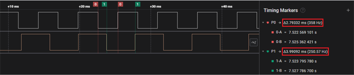

# TCC Compare Mode

This example shows how to use the TCC module in compare mode to generate different  waveforms.

**Parent topic:**[Harmony 3 Peripheral Library Application Examples for PIC32CK-GC/SG Family](GUID-5EB5829A-8D62-4A5E-B89B-DF7EF4E334A2.md)

## Description

Three TCC channels are configured in compare mode. Each channel generates different  output waveform depending upon configured action on compare match and period  match.

**Normal Frequency Mode**: The waveform generation output \(WO\[x\]\) is toggled on  each compare match between COUNT and CCx

**Match Frequency Mode**: The waveform generation output \(WO\[0\]\) is toggled on  each time COUNT register is auto updated.

## Downloading and Building the Application

To clone or download this application from Github, go to the [main page of this repository](https://github.com/Microchip-MPLAB-Harmony/csp_apps_pic32ck_sg_gc) and then  click **Clone** button to clone this repository or download as zip file. This  content can also be downloaded using content manager by following these [instructions](https://github.com/Microchip-MPLAB-Harmony/contentmanager/wiki).

Path of the application within the repository is  **apps/tcc/tcc\_compare\_mode/firmware** .

To build the application, refer to the following table and open the project using its  IDE.

|Project Name|Description|
|------------|-----------|
|pic32ck\_gc01\_cult.X|MPLABX Project for [PIC32CK GC01 Curiosity Ultra board](https://www.microchip.com/en-us/development-tool/ea23j82a)|

## Setting Up the Hardware

The following table shows the target hardware for the application projects.

|Project Name|Board|
|------------|-----|
|pic32ck\_gc01\_cult.X|[PIC32CK GC01 Curiosity Ultra board](https://www.microchip.com/en-us/development-tool/ea23j82a)|

### Setting Up PIC32CK GC01 Curiosity Ultra Board

-   Connect the Debug USB port on the board to the computer using a micro USB cable

## Running the Application

1.  Build and Program the application using its IDE
2.  Observe generated waveforms on the oscilloscope

    |Timer Channel|Pin|Observable characteristic  of the waveform|
    |-------------|---|-------------------------------------------------------------|
    |TCC0\_WO0|PB10 \(Pin 5 of J803 MikroBus  Header\)|Toggle output every 2.80ms|
    |TCC3\_WO0|PA04 \(Pin 3 of EXT1\)|Toggle output every 4.00ms|

PIC32CK GC01 Curiosity Ultra board waveforms:

